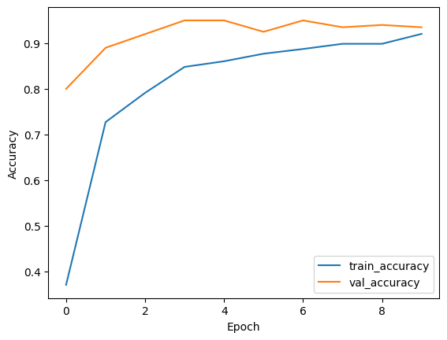
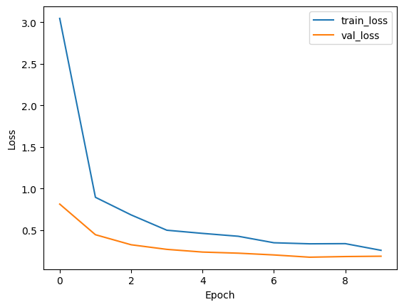

# Image-Classification-Transfer-Learning

## **Project Description:**

This project demonstrates image classification using transfer learning with the VGG16 model on the MNIST dataset. The primary objective is to leverage the pre-trained VGG16 model to classify MNIST digits, which are originally grayscale, by converting them to RGB and resizing them to fit VGG16's input requirements.

## Overview

The project involves the following steps:

1.  **Data Preparation**: Loading, resizing, and normalizing the MNIST dataset.

2.  **Model Building**: Constructing a custom model using the VGG16 base with additional fully connected layers.

3.  **Training**: Training the model using data augmentation to improve generalization.

4.  **Evaluation**: Evaluating model performance and visualizing training history.\`

## Data Description

The MNIST dataset consists of 60,000 training images and 10,000 testing images of handwritten digits (0-9). For computational efficiency, this project uses a reduced dataset:

-   **Training Data**: 1,000 samples

-   **Testing Data**: 200 samples

Each image is originally 28x28 pixels in grayscale.

## Features

-   **Transfer Learning**: Utilizing the VGG16 model pre-trained on ImageNet for feature extraction.

-   **Data Augmentation**: Enhancing the training dataset using transformations like shear, zoom, and horizontal flip.

-   **Model Customization**: Adding custom fully connected layers on top of the VGG16 base model.

-   **Visualization**: Plotting training and validation accuracy and loss to monitor performance.

## Prerequisites

-   Python 3.x

-   TensorFlow

-   Keras

-   NumPy

-   Matplotlib

To install these libraries use: pip install tensorflow numpy matplotlib

## Usage

To run this script follow these steps:

Clone the repository or download the script to your local machine.

Open your terminal and navigate to the script's directory.

Run the script using Python.

## How It Works

1.  **Data Preparation**:

    -   Load the MNIST dataset.

    -   Convert grayscale images to RGB.

    -   Normalize images to the [0, 1] range.

    -   Resize images to 224x224 pixels.

    -   Convert labels to one-hot encoding.

2.  **Model Building**:

    -   Load the VGG16 model without the top layers.

    -   Freeze the layers of the VGG16 model to prevent them from being trained.

    -   Add custom top layers (Flatten, Dense, Dropout, and Softmax).

3.  **Training**:

    -   Use `ImageDataGenerator` for data augmentation.

    -   Train the model with the augmented data for a specified number of epochs.

    -   Compile the model with Adam optimizer and categorical cross-entropy loss.

4.  **Evaluation and Visualization**:

    -   Evaluate the model on the test data.

    -   Plot training and validation accuracy and loss.

## Results

-   **Average Accuracy**: Achieved 80.81% by the end of the 10th epoch.

-   **Average Validation Accuracy**: Approximately 91.95% by the end of the 10th epoch.

-   **Training and Validation Loss**: Training loss decreases significantly, while validation loss stabilizes, indicating potential overfitting.

### Plots

#### Accuracy

#### Loss

## Conclusion

This project successfully demonstrates the application of transfer learning using the VGG16 model for image classification on the MNIST dataset. The model achieves high training accuracy, though there is room for improvement in validation accuracy. Potential enhancements include increasing the dataset size, using more aggressive data augmentation, and fine-tuning pre-trained layers.

## Contributing

Contributions to this project are welcome. Please fork the repository and submit a pull request with your suggested changes.
